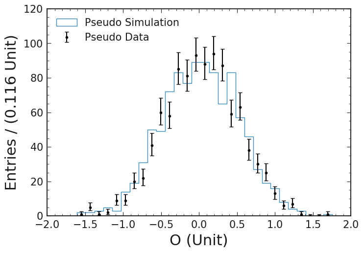

======
b2plot
======

This is the documentation of **b2plot**.

This package contains a set of helper functions and wrappers around `matplotlib` for producing scientific plots.
One of the main features is the ``hist`` function, which can be used like matplotlib analogon, but has additional features, such as remembering the x-axis binning.

.. code:: python

    import b2plot as bp

    bp.hist(np.random.normal(0, 0.5, 1000), label="Pseudo Simulation")
    bp.errorhist(np.random.normal(0, 0.5, 1000), label="Pseudo Data", color='black')

    bp.labels("O", "Entries", "Unit")
    plt.legend()

   Example showing the automatic binning.

Contents
========

.. toctree::
   :glob:
   :maxdepth: 2

   install
   usage
   style_guide/guide
   Module Reference <api/modules>

Indices and tables
==================

* :ref:`genindex`
* :ref:`modindex`
* :ref:`search`
