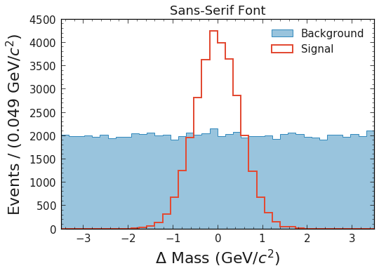
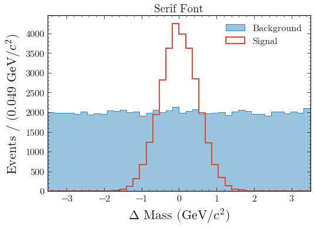

Fonts
=====

Typography is a whole science on its own, which makes it hard to give
specific recommendations. In general there are *Serif* fonts, which are
more traditionally looking, and *Sans-Serif* fonts, which have a more
modern appeal.

**Which font you choose, may however be subject to the jurnal.**

