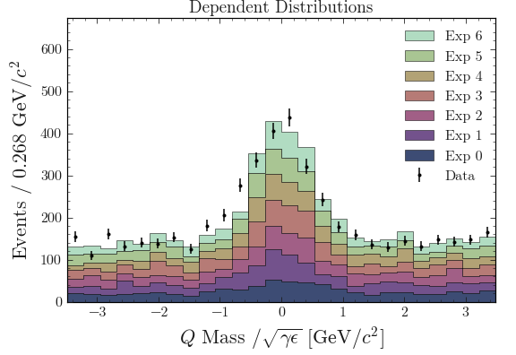
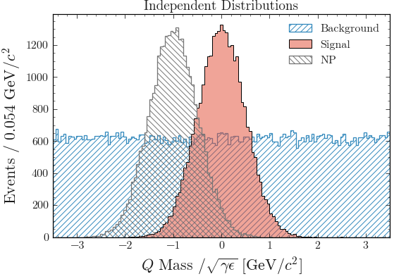

Plotting Several Distributions
==============================

*Differentiate between stacked and non-stacked.*

Stacked Distributions
---------------------

If you plot several dependent distributions, such as subsets of one larger data-set they should be plotted as a *stacked histogram*.

For dependent distributions:

* Have the same filling style
* At best, colors vary in intensity, from dark at the bottom to light at the top

   Example of a stacked histogram

Independent Distributions
-------------------------

If you plot several independent distributions, they should all have different styles.
This could be different line styles or fillings with different hatches.

   Example of independent distributions

