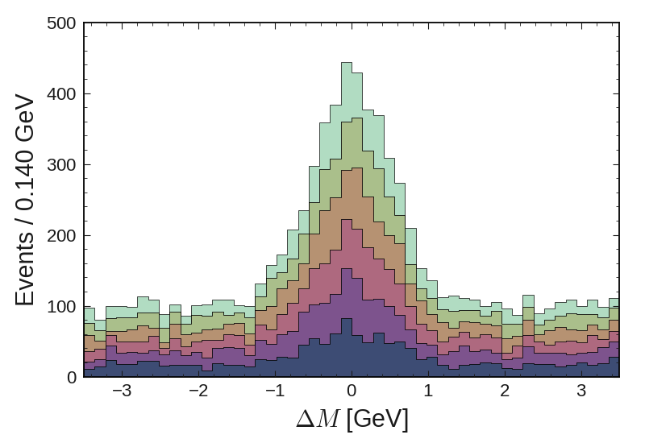

Usage
=====

After installation you can use the style with matplotlib:

.. code:: python

    import matplotlib.pyplot as plt

    plt.style.use('belle2')

One of the main features is the ``hist`` function, which can be used
like matplotlib analogon, but has additional features, such as
remembering the x-axis binning.

.. code:: python

    import b2plot

    b2plot.hist(np.random.normal(0, 0.5, 1000))
    b2plot.labels("O", "Entries", "Unit")

As the x-axis is stored, once you plot multible histograms or error bars
on the same plot, all share the binning of the first.

.. code:: python

    import b2plot as bp

    bp.hist(np.random.normal(0, 0.5, 1000), label="Pseudo Simulation")
    bp.errorhist(np.random.normal(0, 0.5, 1000), label="Pseudo Data", color='black')

    bp.labels("O", "Entries", "Unit")
    plt.legend()

.. figure:: ../examples/histogram2.png
   :alt: Title

   Example

Predefined styles make it easy to plot different histogram into one plot.

.. code:: python

    bp.hist(np.random.normal(0, 0.4, 1000), range=(-1, 8), label="None")
    for i in range(6):
        bp.hist(np.random.normal(1+i, 0.4, 1000), style=i, label="Style %d"%i)

.. figure:: ../examples/histogram_styles.png
   :alt: Title

   Example

Another feature is to create stacked histograms easily.

.. code:: python

    # Assuming a dataframe with columns "mass" and "exp"
    bp.stacked(df, col="mass", by='exp', bins=50,)

   Example

